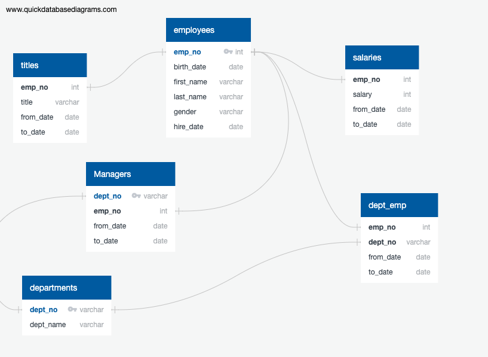

# Pewlett Hackard Analysis

### Brief project summary
* List current employees eligible for retirement, as well as their most recent titles. (number_of_titles_retiring)
* Show how many current employees of each title are presently eligible for retirement. (frequency_count_of_titles)
* The final list the potential mentor’s employee number, first and last name, their title, birth date and employment dates. (ready_for_a_mentor)

### Generated the following tables:
* number_of_titles_retiring 
* frequency_count_of_titles
* ready_for_a_mentor

Exported data to csv

